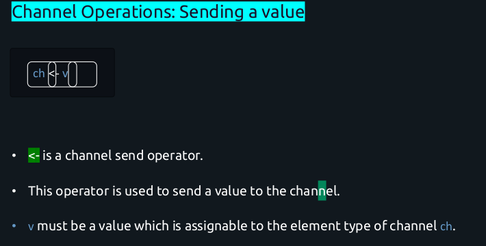
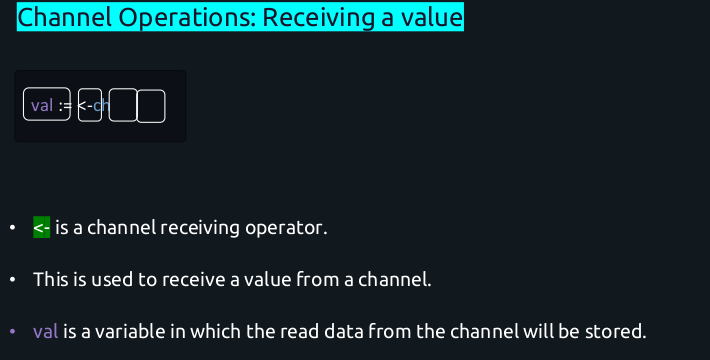
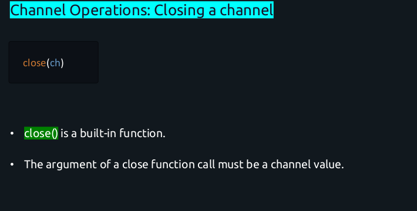
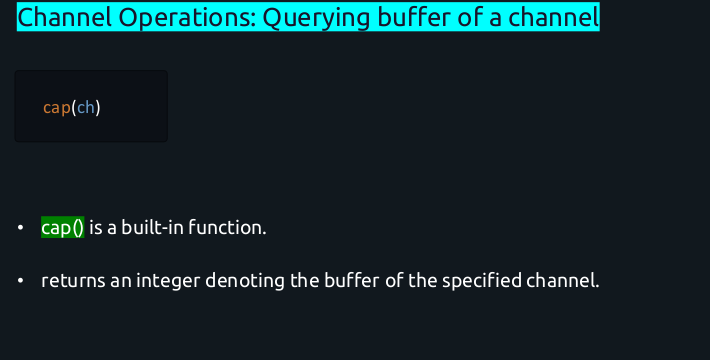
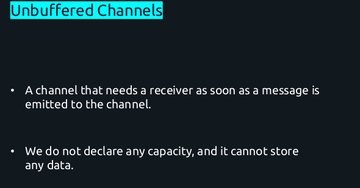
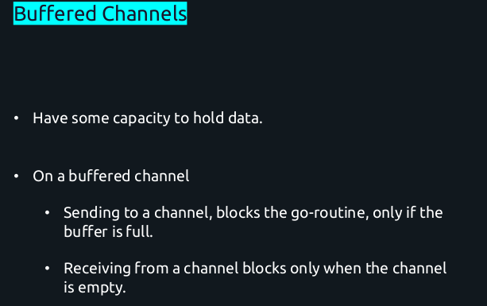
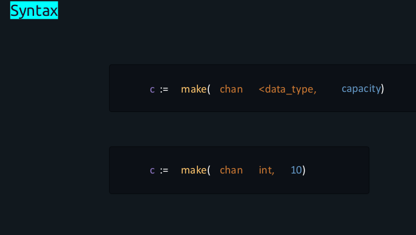
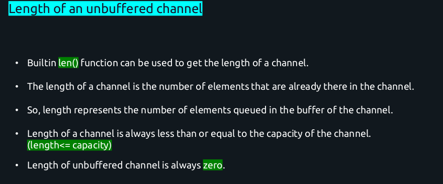

## Modules, Packages and Imports:

Library manages in go consist of Repository, Module and Packages.

**Repository:** A repository is a version-controlled storage space for your code, typically hosted on a platform like GitHub, GitLab, or Bitbucket. Repository = Collections<modules>

In Go projects, the repository often contains one or more modules and serves as the main container for project source code. A repository is not specific to Go; It’s a general concept used across all programming languages to manage and track code.

Example: Imagine you are developing a library for handling `payment-processing` 
    
1. You might create a GitHub repository named `github.com/username/payment-library`.

 2. Inside this repository, you could have various modules or packages for handling different aspects of payments (e.g., credit card processing, wallet support).

**Module:** A module in Go is a collection of related Go packages that are versioned together. Example: ReposModuleitory = Collections<Packages>

Modules are the fundamental unit of dependency management in Go. A module is defined by a `go.mod` file, which specifies the module's path (often the repository URL) and dependencies. 
 1. The `go.mod` file tells the Go tool where to find packages and which versions to use, making dependency management easier
 2. A Go project can have multiple modules, but typically, a single module suffices for many projects.
    
Example: Continuing from the repository example, you could define a module within it:

 ``` go mod init github.com/username/payment-library```

This command creates a `go.mod` file with `github.com/username/payment-library` as the module path. All packages in this repository now belong to this module.

Contents of `go.mod`:
```
module github.com/username/payment-library

go 1.20
require github.com/some/dependency v1.2.3

```
**Package:** A package in Go is the smallest unit of code organization and is essentially a collection of related Go source files.

Each Go file within a package shares the same `package` name at the top of the file. Packages are where actual code is implemented, and they can be imported into other Go programs to reuse functionality.

1. By convention, Go packages are organized within folders, with each folder containing one package.
2. The `main` package is special because it defines an executable program, whereas other packages typically define reusable libraries.

Example:
Within your payment module, you could have several packages:
```
payment-library/
├── go.mod
├── payment/
│   ├── creditcard.go      // package payment
│   ├── wallet.go          // package payment
├── utils/
│   ├── helper.go          // package utils
└── main.go                // package main
```
Here’s how the files might look:
1. `creditcard.go` in the `payment` package:
```
package payment

func ProcessCreditCard() {
    // Implementation here
}

```
2. `helper.go` in the `utils` package:
```
package utils

func ValidatePaymentDetails() {
    // Validation code here
}

```
3. main.go in the main package (for executing the application):
```
package main

import (
    "github.com/username/payment-library/payment"
    "github.com/username/payment-library/utils"
)

func main() {
    payment.ProcessCreditCard()
    utils.ValidatePaymentDetails()
}

```

Summary:
1. **Repository:** The main storage unit for your project code (e.g., GitHub, GitLab). A repository may contain one or more modules and packages.

2. **Module:** A collection of Go packages, versioned together, and defined by a go.mod file. It’s the unit of dependency management.

3. **Package:** A single unit of code organization within a module. Each folder generally contains one package, and each package may contain several related functions or types.

The `go mod tidy` command in Go is used to clean up and optimize your module's dependencies in the `go.mod` and `go.sum` files.


#### Creating and accessing a package in module

```
# Initialize a new Go module (run in the root directory of the module)
go mod init <module-path>
# Example: go mod init github.com/username/repository-name/module-name

# Download and tidy up dependencies (removes unused packages)
go mod tidy

# Update dependencies to the latest versions (based on semantic versioning)
go get -u ./...

# Add or upgrade a specific dependency
go get example.com/some/dependency@latest

# List all dependencies in the module
go list -m all
```

#### Golang concurrency
Topics:
1. Sequential and Concurrent 
2. Concurrency and Parallelism
3. use of Goroutine 
4. waitGroup
5. Anonyous goroutine
6. Go runtime scheduler
Scheduler is responsible for managing the execution of goroutines. 

Goroutines are lightweight, concurrent functions that allow Go applications to perform concurrent operations efficiently. The Go scheduler is designed to efficiently manage these goroutines across available processor cores, balancing workload and maximizing performance. 

Go uses a concurrency model based on communicating sequential processes (CSP), where goroutines communicate using channels.

### Core Concepts of the Go Scheduler:

**M:N Scheduling** The Go scheduler employs an M:N model, where M goroutines are scheduled to run on N OS threads. This model enables efficient use of system resources without needing one-to-one mapping between goroutines and threads.

Components of the Scheduler:
1. **M (Machine):** Represents an OS thread. It executes Go code.
2. **P (Processor):** Represents a logical processor that manages a set of goroutines. Each P is   assigned to one M at a time.
3. **G (Goroutine):** The actual goroutine ready to run.

**Work-Stealing:** Go's scheduler implements a work-stealing strategy to balance load across multiple processors. If a processor's run queue is empty, it can "steal" goroutines from another processor's run queue to keep execution balanced.

**Preemption and Fair Scheduling:** 
1. The Go scheduler uses preemption to ensure that no single goroutine monopolizes the processor.
2. It tries to allocate execution time to goroutines fairly, ensuring responsive and efficient execution.

**Blocking Operations:** 
The scheduler efficiently handles blocking operations. When a goroutine performs a blocking operation (e.g., waiting for I/O), it gets descheduled, freeing up the M (thread) for other goroutines.

Runtime Scheduler in a nutshell: 
What happens when you start a Go program? the go progeam will launch OS level threads equal to the number of logical CPU's that's are available to it. this threads are OS thread and completely managed by Kernel/OS. From creating, blocking, scheduling them by OS.

We can find out the number of logical processors using the `runtime.Numcpus` method.
Logical cores = number of physical cores * number of threads that can run on each core
(aka hardware threads). 

Go-Routine:
1. Considered as a lightweight application-level thread that has a separate independent execution.
2. The go runtime has its own scheduler that will multiplex the go-routines on the OS level threads in the go runtime.
3. It schedules an arbitrary number of go-routines onto an arbitrary number of OS threads ( `m:n multiplexing` ).

go-runtime scheduler: 
OS scheduler manages the OS threads for each logical core in our system. within go runtime, each of this thread will have one queue associated with it, it is called LRQ(Local Run Queue). It consist of local goroutines that will be executed in the context of that thread. the go-runtime scheduler will be doing this scheduling and context switcing of the goroutine belonging to a particular LRQ. also have another one more queue called GRQ(Global Run Queue).
It contains all the goroutine that have not been move to any LRQ of any OS thread. go scheduler assign a goroutine from this queue to any LRQ of any OS thread. This is the high  level overview of how the go-scheduler works and multiplexes goroutines on the OS thread. 

//todo add goroutines images.
1. Golang scheduler is a `cooperative scheduler`. cooperative scheduler mean non-preemptive Scheduling that there is no time based preemption that is happening from the OS.
Cooperative scheduling is a style of scheduling in which the OS never interrupts a running process to initiate a context switch from one process to another.
2. In fact, the Processes must `voluntarily` yield control periodically or when logically blocked on a resource.
3. Of course, there are some specific check points where go-routine can yield its execution
to other go-routine. These are called `context switches`.


Some example of context switching:
1. Function call
2. Garbage collection
3. Network calls
4. channel operation
5. on using `go` keyword.

Go-routine vs Threads:
1. Go-routines are cheaper, few KB.
2. Go-routines are `multiplexed to a fewer number of OS threads`.
3. The `context switching` time of go-routines is much `faster`.
4. Go-routines communicate using channels.

#### Wait-Groups
1. The problem with go-routines was the `main go-routine terminating` before the go-routines completed or even began their execution.
2. To wait for multiple go-routines to finish, we can use a `wait group`.
3. A wait group is a `synchronization primitive` that allows multiple go-routines to wait for each other.
Synchronization Primitive - To manage and coordinate access to shared resources in concurrent programming.These primitives help ensure that operations on shared data are performed safely and predictably when multiple threads, processes, or goroutines are involved.
Common Synchronization Primitives:

`i. Mutex:` Ensures that only one thread or goroutine accesses a critical section of code or a shared resource at a time

`ii. RWMutex (Read-Write Mutex):` Allows multiple readers or a single writer to access a resource. Useful when read operations are more frequent than write operations.

`iii. WaitGroup:` Waits for a collection of goroutines to complete.

`iv. Condition Variables:` Used to block goroutines until a specific condition is met.Built on top of a mutex.
    
`v. Channels (Specific to Go):` Used to safely share data between goroutines. Channels act as both a synchronization and communication primitive.

`vi. Semaphores:` Control access to a limited number of resources. Go doesn’t have native semaphores but can be implemented using channels.

Why Use Synchronization Primitives?

i. Avoid Race Conditions:

ii. Coordinate Tasks

iii. Prevent data corruption during concurrent access.


##### Real-Life Example:
Suppose you’re implementing a banking system where multiple transactions modify a shared account balance. Without synchronization, concurrent access could lead to incorrect results.
Example Using a Mutex:
```
package main

import (
    "fmt"
    "sync"
)

var balance int
var mu sync.Mutex

func deposit(amount int, wg *sync.WaitGroup) {
    defer wg.Done()
    mu.Lock()
    balance += amount
    mu.Unlock()
}

func main() {
    var wg sync.WaitGroup
    wg.Add(2)
    go deposit(100, &wg)
    go deposit(200, &wg)
    wg.Wait()
    fmt.Println("Final Balance:", balance)
}

```
 i. Without the Mutex: Race conditions may occur, leading to incorrect balances.
ii. With the Mutex: Only one goroutine can modify the balance at a time, ensuring correctness.

4. This package acts like a counter that blocks execution in a structured way until its internal counter becomes 0.

```
Wait group syntax:

VAR VARIABLE_NAME DATA_TYPE
var wg sync.WaitGroup
```
**Wait-group Method:**
```
1. wg.Add(int) -> This indicates the number of available go-routines to wait for.
The integer in the function parameter acts like a counter.
```
```
2. wg.Wait() -> This method blocks the execution of code until the internal counter reduces to `value = 0`.
```


```
3. wg.Done() -> This method decreases the internal count parameter in 
`Add() method by 1.`
```


### Channel: 
* Channels are a means through which different go-routines communicate.
* `“Do not communicate by sharing memory; instead, share memory by communicating”` – Rob Pike 
* Communicate by sharing memory – Threads and mutexes
* Share memory by communicating – Go-routines and channels.

Typically shared-data structure are protected by Locks and Threads contend over those locks to access the data. Hence, communicating each other by sharing memory in form of data. while go's concurrency primitives which are goroutines and channels provide us an elegent and distinct means of `strucing concurrent` software. Instead of explicitly use of locks to miniate access to shared data, go encouragea to use of channels, to pass references/memory to data between goroutine. This approach ensures that only one goroutine has access to the data at a given time, hence `sharing memory by communicating`.

* The communication is `bidirectional by default`, meaning that you can `send and receive` values from the `same channel`.
* By default, channels send and receive until the other side is ready.
* This allows go-routines to synchronize without explicit locks or condition variables.

```Syntax:
var ch chan string
ch := make( chan string)
```
A channel can only hold `string or int` data types. Channel can be bidirectional or single unidirectional.

Channel Operations:

* Sending a value
* Receiving a value
* Closing a channel
* Querying Buffer of a channel
* Querying length of a channel
<br>
<br>
<br>
<br>
<br>

#### buffered channels
<br>
<br>
<br>
<br>
